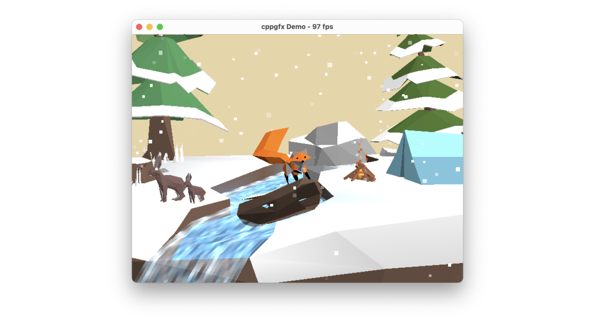

# cppgfx

_- "Look mom, no GPU!"_



cppgfx is a CPU-based graphics library for C++.

[Online Demo](https://dervis.de/cppgfx.html)

## Features

- Draw directly into a surface pointer
- Write vertex and pixel shaders directly in C++ as functors, including state
  - Instant access to uniform data
  - Arbitrary vertex inputs and outputs
- Stateless drawing functions
- Alpha blending (blend states)
- Depth buffering
- Image sampling (samplers) including optional linear filtering
- Multiple render targets
- Standalone, no dependencies beside the C++ STL
    - Plug & play
- Multithreaded rasterization using OpenMP if available
- Pretty fast!

For a draw call, almost the entire pipeline state is specified. Where possible, the library infers some information for you. This allows the library to decide which code paths to take at compile time. You therefore only pay for what you use. 

## Usage

Either

  1) `add_subdirectory(cppgfx)`, then
  2) `target_link_libraries(MyApp PRIVATE cppgfx)`
  3) `#include <cppgfx.hpp>`

or

  - copy `cppgfx.hpp` to your project and `#include` from there.

## Example

See the `demo` folder for an example application. It uses CMake and downloads all dependencies automatically. Configure & build as usual:

```bash
> cd cppgfx
> cmake -S . -B build
> cmake --build build --parallel
```

## Why software rasterization?

Well, sometimes, especially in the medical field (e.g. hospitals or radiology practices), you have workstations without any sort of GPU. Even if there's a GPU, you cannot fully trust the driver to be bug-free or have deterministic behavior. If you're for example required to use OpenGL and can't trust the target drivers, you could circumvent this by using [Mesa/llvmpipe](https://docs.mesa3d.org/drivers/llvmpipe.html) as a drop-in replacement. Same goes for Direct3D with [WARP](https://learn.microsoft.com/en-us/windows/win32/direct3darticles/directx-warp).

This works fine for most cases. However, there are also cases where you need a minimal renderer that is platform-independent, does not require upfront work such as setting up a context, and is just happy to take some geometry and render target pointer; no state management necessary.

Another case would be for cheap rendering tasks where CPU ⇄ GPU synchronization would be too expensive or when the CPU has some spare idle time. See [DICE's Occlusion Culling Method](https://www.slideshare.net/DICEStudio/culling-the-battlefield-data-oriented-design-in-practice) in Battlefield 3 for example, where they determined occluded geometry CPU-side before sending it to the GPU. A similar method has also been [used in Crytek's CryENGINE 3](https://www.slideshare.net/TiagoAlexSousa/secrets-of-cryengine-3-graphics-technology).

**TL;DR**: Software renderers to this day have their use, especially in cases where no GPU is available. Even though GPUs are feature-rich, software renderers provide hassle-free and highly-flexible drawing operations, down to the pixel. Additionally, they may be used to support and relieve the GPU, instead of replacing it. 
